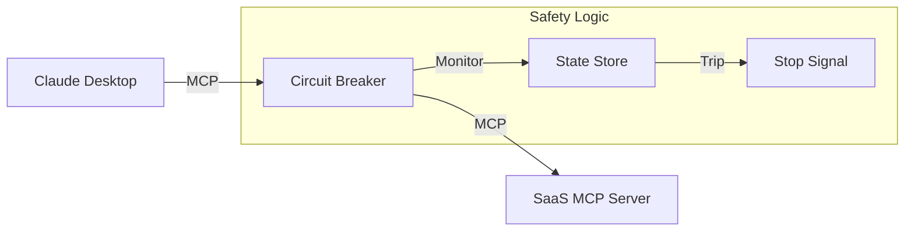

# mcp-circuit-breaker

A programmable safety layer for the **Model Context Protocol (MCP)**. It detects and breaks agentic infinite loops, preventing "token-burn" and protecting downstream SaaS APIs (Salesforce, Zendesk, Stripe) from repetitive, autonomous failures.

## 🚀 Features

*   **Pass-Through Proxy**: Seamlessly wraps any existing MCP server (stdio).
*   **Threshold Monitoring**: Tracks consecutive failures and trips a circuit breaker to stop agents from retrying indefinitely.
*   **Semantic Intervention**: Returns a "SYSTEM OVERRIDE" message to the LLM to force it to stop.
*   **Auto-Reset (Half-Open)**: Automatically tests if the circuit can be closed after a cooling-off period.
*   **Configurable**: Tune failure thresholds, window sizes, and timeouts.
*   **MIT Licensed**: Open source and ready for enterprise.

## 📦 Installation

```bash
# Using pip
pip install mcp-circuit-breaker

# Using poetry
poetry add mcp-circuit-breaker
```

*Note: This package is currently local. You can install it from source.*

## 🛠 Usage

### The "Sidecar" Pattern (Enterprise Best Practice)

This project allows you to implement the **Sidecar Pattern**. Instead of a single "Universal Gateway" that could be a single point of failure, you wrap each critical tool individually. This provides:
1.  **Isolation**: If the `filesystem` breaker trips, your `salesforce` tools keep working.
2.  **Granular Security**: Apply `STRICT` mode to sensitive tools and `COOL-OFF` mode to others.

### Quick Start (Intuitive Override)

To make the circuit breaker "intuitive" (invisible to the Agent), you can configure it to **replace** the standard tool entry in your `claude_desktop_config.json`.

**Example: Replacing the Filesystem Server**

Copy the contents of `manual_test_config.json` (replacing paths with your own):

```json
{
  "mcpServers": {
    "filesystem": {
      "command": "/path/to/mcp-circuit-breaker/.venv/bin/python",
      "args": ["-m", "mcp_circuit_breaker"],
      "env": {
        "DOWNSTREAM_COMMAND": "npx",
        "DOWNSTREAM_ARGS": "[\"-y\", \"@modelcontextprotocol/server-filesystem\", \"/Users/username/Desktop\"]", 
        "CB_FAILURE_THRESHOLD": "3",
        "CB_RESET_TIMEOUT": "30"
      }
    }
  }
}
```

Now, whenever Claude tries to use `read_file` or `list_directory`, it transparently goes through the Circuit Breaker.

### Configuration (Environment Variables)

| Variable | Default | Description |
| :--- | :--- | :--- |
| `CB_FAILURE_THRESHOLD` | `5` | Max consecutive failures before tripping. |
| `CB_WINDOW_SECONDS` | `60` | Time window for rate limiting. |
| `CB_RESET_TIMEOUT` | `30` | Seconds to wait in OPEN state before trying HALF-OPEN. |
| `CB_MAX_REQUESTS_PER_WINDOW` | `10` | Max requests allowed in the window. |
| `DOWNSTREAM_COMMAND` | **Required** | The executable for the target MCP server. |
| `DOWNSTREAM_ARGS` | `[]` | Arguments for the target server (JSON list or space-separated). |

## 🏗 Architecture

The Circuit Breaker sits between the Client (Claude/Cursor) and the Server (SaaS tool).



## 🤝 Contributing

1.  Clone the repo.
2.  Install dependencies: `poetry install`.
3.  Run tests: `poetry run pytest`.

## 📄 License

MIT
